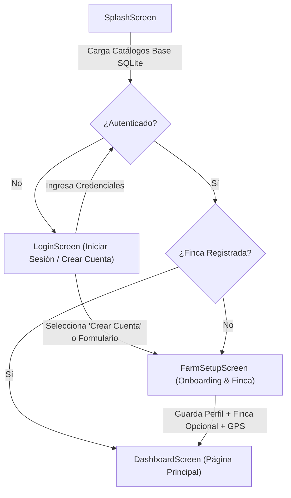

# DOCUMENTACIÓN TÉCNICA DEL SISTEMA DE GESTIÓN GANADERA (AGROSTATS)

## 📌 1. Visión General del Sistema

El sistema **AgroStats** es una plataforma integral distribuida para el control técnico, sanitario y productivo del hato bovino en fincas ganaderas. Su arquitectura está compuesta por tres componentes principales:

1. **Aplicación Móvil (Flutter / Dart)**: Operación en campo con arquitectura **Offline-First**, respaldada por una base de datos **SQLite local**.
2. **API REST Server (.NET 9 C#)**: Servidor backend con persistencia en **PostgreSQL (Neon DB)**, autenticación mediante **JWT** y ORM **Entity Framework Core**.
3. **Plataforma WEB (React / TypeScript / Vite / TailwindCSS)**: Torre de control ejecutiva para supervisión por parte de administradores y supervisores técnicos.

---

## 🔄 2. Secuencia de Pantallas y Onboarding Móvil

El flujo de navegación de la aplicación móvil se diseñó para garantizar que un ganadero pueda operar sin fricciones:

### Campos del Formulario de Onboarding / Perfil:
1. **Nombre Completo** (*Obligatorio*): Nombre completo del ganadero.
2. **Número de Teléfono** (*Obligatorio*): Teléfono de contacto y credencial de acceso.
3. **Departamento** (*Obligatorio*): Selección desde el catálogo geográfico local.
4. **Municipio** (*Obligatorio*): Filtrado en cascada según el departamento seleccionado.
5. **Comarca** (*Obligatorio*): Comarca de la finca.
6. **Nombre de Finca** (*OPCIONAL*): Si el usuario lo deja en blanco, el sistema le asigna un nombre descriptivo por defecto (`"Finca Principal"` o `"Finca de [Nombre]"`).
7. **Captura GPS** (*Captura Satelital*): Coordenadas geográficas latitud y longitud.

---

## 🧮 3. Fórmulas e Indicadores Zootécnicos Implementados

### A. Unidades de Ganado Mayor (UGM)
Estandarización recomendada por FAO/IICA para determinar la carga animal de la finca:
$$\text{UGM Total} = \sum (\text{Cantidad por Categoría} \times \text{Factor UGM})$$
- **Toro Reproductor** ($>24$ meses): `1.2 UGM`
- **Vaca Adulta** ($>24$ meses): `1.0 UGM`
- **Vaquilla / Novillo** ($12 - 24$ meses): `0.7 UGM`
- **Ternero / Destaque** ($<12$ meses): `0.4 UGM`

### B. Rendimiento Lácteo y Densidad
- **Promedio Diario por Vaca en Ordeño (L/vaca/día)**:
  $$\text{Promedio Diario} = \frac{\text{Total Litros del Día}}{\text{Vacas Distintas Ordeñadas en el Día}}$$
- **Conversión Litros a Masa en Kilogramos** (Densidad promedio de la leche bovina = 1.032 kg/L):
  $$\text{Masa (Kg Leche)} = \text{Litros} \times 1.032$$

### C. Alerta Sanitaria de Retiro de Leche (Tiempo de Carencia por Medicamento)
- **Fórmula de Retiro Sanitario**:
  $$\text{En Retiro} = \text{Fecha Actual} \le (\text{Fecha Aplicación Tratamiento} + \text{Días de Retiro del Medicamento})$$
- **Control de Bioseguridad**: Si un animal está bajo tratamiento, la app móvil y la web emiten un aviso `⚠️ RETIRO SANITARIO` indicando que esa leche es de descarte y **no apta para venta comercial**.

---

## 🗄️ 4. Esquema de Base de Datos (PostgreSQL & SQLite)

### Tablas de Catálogos (Bloque A)
- `departamentos`: `id`, `nombre`
- `municipios`: `id`, `departamento_id`, `nombre`
- `comarcas`: `id`, `municipio_id`, `nombre`
- `razas_bovinas`: `id`, `nombre`, `origen_genetico`, `proposito` (1=Leche, 2=Carne, 3=Doble)
- `enfermedades`: `id`, `nombre`, `descripcion`, `notificacion_obligatoria`
- `sintomas`: `id`, `enfermedad_id`, `nombre`
- `medicamentos`: `id`, `nombre_comercial`, `principio_activo`, `via_administracion`, `dias_retiro_leche`

### Tablas Operativas (Bloque B)
- `usuarios_app`: `id`, `telefono`, `nombre`, `clave_hash`, `municipio_id`, `comarca`
- `fincas`: `id`, `usuario_app_id`, `municipio_id`, `nombre`, `comarca`, `latitud`, `longitud`
- `animales`: `id`, `finca_id`, `raza_id`, `identificacion`, `sexo` (1=Hembra, 2=Macho), `fecha_nacimiento`, `estado`
- `produccion_leche`: `id`, `animal_id`, `fecha`, `jornada` (1=AM, 2=PM), `volumen_litros`
- `registros_salud`: `id`, `animal_id`, `enfermedad_id`, `fecha_deteccion`, `observaciones`
- `tratamientos`: `id`, `registro_salud_id`, `medicamento_id`, `dosis_aplicada`
- `auditoria_logs`: `id`, `usuario_app_id`, `finca_id`, `tipo_entidad`, `accion`, `latitud`, `longitud`, `fecha_sincronizacion`

---

## 💻 5. Funcionalidades de la Plataforma Web

1. **Dashboard Ejecutivo**:
   - Tarjetas KPI dinámicas (Fincas, Censo Bovino, UGM, Producción L/Kg, Alertas Medicamentos).
   - Gráfico de tendencia semanal de producción láctea.
   - Monitoreo en tiempo real de fincas y bioseguridad.
2. **Padrón Institucional de Ganaderos (`/farmers`)**:
   - Filtro interactivo de ganaderos registrados, teléfonos, municipios y conteo de ganado.
3. **Auditoría de Sincronizaciones (`/sync-logs`)**:
   - Bitácora de eventos offline sincronizados desde los teléfonos en campo con coordenadas GPS.
4. **Gestión de Catálogos Maestros (`/catalogs`)**:
   - Administración con pestañas para Enfermedades, Medicamentos (con días de retiro) y Razas Bovinas.

---

## 🌐 6. Endpoints de la API REST (.NET 9)

- `POST /api/auth/register`: Registro de usuario ganadero desde la app móvil.
- `POST /api/auth/login`: Autenticación de ganadero.
- `POST /api/web-auth/login`: Autenticación de administradores web.
- `GET /api/dashboard/kpis`: Métricas KPI globales.
- `GET /api/dashboard/produccion-tendencia`: Datos de producción de 7 días.
- `GET /api/dashboard/mapa-fincas`: Censo geográfico de fincas.
- `GET /api/web-auth/ganaderos`: Padrón de ganaderos app.
- `GET /api/web-auth/auditoria-sync`: Logs de sincronizaciones offline.
- `GET/POST /api/catalogos/enfermedades`: Catálogo de enfermedades y síntomas.
- `GET/POST /api/catalogos/medicamentos`: Catálogo de medicamentos y tiempo de carencia.
- `GET /api/catalogos/razas`: Catálogo de razas bovinas.
